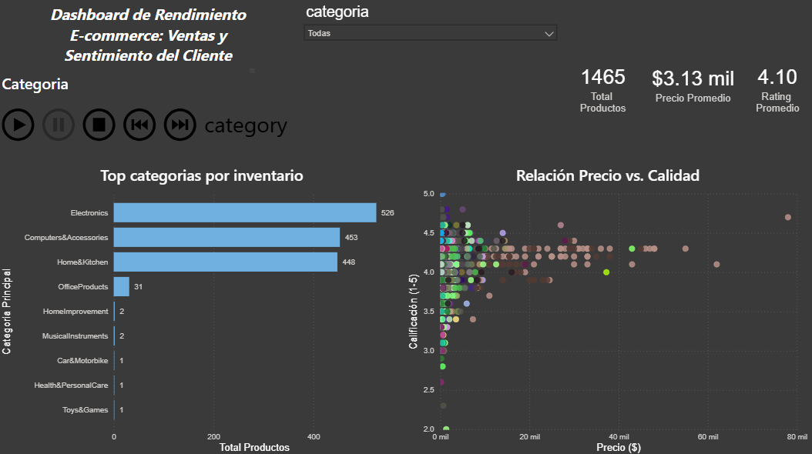

# 📊 Amazon E-commerce Performance Dashboard

**Análisis de inteligencia de negocios para optimizar precios y calidad en +1,400 productos.**

### 🚀 Resumen del Proyecto
Este proyecto simula un entorno real de BI donde se extraen datos crudos, se limpian y se transforman en insights accionables.

### 🛠️ Herramientas Utilizadas
* **Python (Pandas):** Para limpieza de datos (ETL) y manejo de strings.
* **SQL:** Para consultas de validación y segmentación.
* **Power BI:** Para visualización interactiva y storytelling de datos.

### 💡 Hallazgos Principales
1.  **Saturación:** La categoría *Electronics* domina el inventario pero tiene márgenes ajustados.
2.  **Mito del Precio:** Los productos caros no siempre tienen mejores calificaciones; el "sweet spot" está en la gama media.
